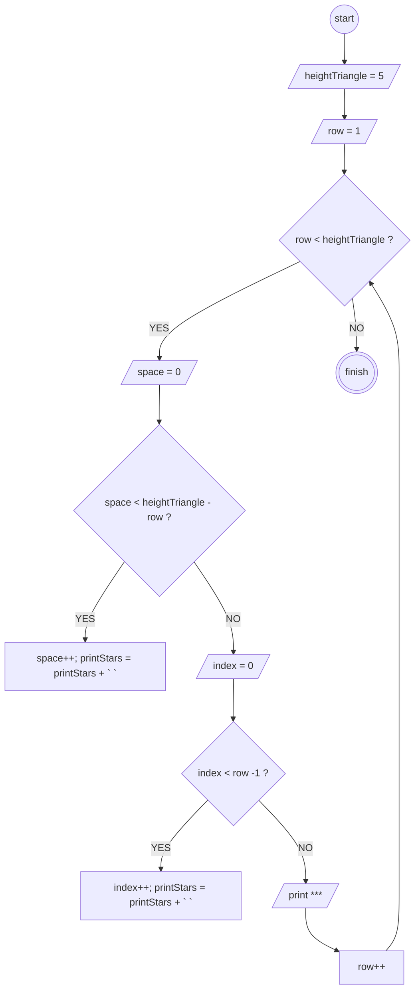

# Flowchart

```mermaid

flowchart TD
    start((start))

    inputHeight[/heightTriangle = 5/]

    inputRow[/row = 1/]

    checkRow{row < heightTriangle ?}

    inputSpace[/space = 0/]

    checkSpace{space < heightTriangle - row ?}

    printStars[space++; printStars = printStars + ` `]

    index[/index = 0/]

    checkRight{index < row -1 ?}

    printStars2[index++; printStars = printStars + ` `]

    printAllStars[/print ***/]

    increment[row++]


    finish(((finish)))

    start -->inputHeight
    inputHeight -->inputRow
    inputRow --> checkRow

    checkRow -- YES --> inputSpace
    inputSpace --> checkSpace

    checkSpace -- YES --> printStars
    checkSpace -- NO --> index

    index --> checkRight
    checkRight -- YES --> printStars2

    checkRight -- NO --> printAllStars

    printAllStars --> increment

    increment --> checkRow


    checkRow -- NO --> finish


```
